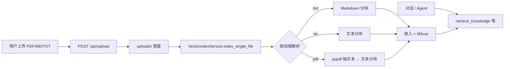

# 个人文档上传与 RAG 检索实施计划

> **目标**：支持个人上传 **PDF / Markdown**（并可与现有 **TXT** 并存），后台完成 **解析 → 分块 → 向量化 → 写入 Milvus**，用户提问时由现有 Agent 通过 **`retrieve_knowledge` / `retrieve_enriched_context`** 检索已入库内容。  
> **状态**：**P0–P4 已落地**；**P5 部分完成**（README 补充上传格式）；P6 可选增强待办。

---

## 0. 现状摘要（仓库当前行为）

| 环节 | 现状 |
|------|------|
| 上传 API | `POST /api/upload`，允许 **`.txt` / `.md` / `.pdf`**，保存至 `./uploads` |
| 目录索引 | `POST /api/index_directory`，默认扫描 `uploads` 下 **`.txt` / `.md` / `.pdf`**（含常见大小写扩展名） |
| 解析与分块 | `DocumentSplitterService`：`.md` 走标题+递归分块；**PDF 先经 `source_text_reader.read_source_text` 抽文本再当纯文本分块** |
| 单文件索引 | `VectorIndexService.index_single_file` 使用 **`read_source_text`**（UTF-8 文本 + **pypdf**） |
| 向量库 | `VectorStoreManager` + Milvus；`retrieve_knowledge` 已接检索链 |

**结论**：Markdown、纯文本与 **PDF（文本型）** 入库链路已接通；扫描件 OCR 等仍为后续项。

---

## 1. 设计原则

1. **与现有 RAG 同一套 Milvus collection / 元数据约定**（`_source` 等为文件路径），避免双库。  
2. **上传即索引**（与现逻辑一致）：上传成功后再索引；索引失败时文件仍落盘，但响应中应可区分（沿用或增强返回字段）。  
3. **PDF 先走「文本抽取」**：一期用 **`pypdf`** 做页级 `extract_text`；扫描件 OCR、表格结构解析列为 **后续**。  
4. **安全与限额**：单文件大小上限、文件名消毒沿用；PDF 可单独限制页数或总抽取字符上限（防恶意大文件）。  
5. **个人使用**：不按租户隔离；与现有 `uploads/` 个人知识库语义一致。

---

## 2. 目标架构（数据流）

---

## 3. 分阶段实施路线（建议顺序）

| 阶段 | 内容 | 验收要点 |
|------|------|----------|
| **P0** | 依赖：`pypdf` 写入 `pyproject.toml`；可选配置项如 `pdf_max_pages`（默认合理值） | `pip install` / lock 可安装 |
| **P1** | 抽取层：**`read_source_text(Path)`**（UTF-8 文本 + **pypdf** 抽 PDF；`pdf_max_pages` / `pdf_max_extract_chars`） | 单元测试 mock `pypdf.PdfReader` |
| **P2** | `split_document`：`.pdf` 抽文本后走 **`split_text`**（与 txt 一致）；`.md` 保持现有逻辑 | 分块元数据 `_extension` / `_source` 正确 |
| **P3** | `VectorIndexService`：`index_single_file` 按后缀选择读取方式；`index_directory` 增加 **`*.pdf`** | 本地 `uploads` 放 pdf+md 跑 `index_directory` 全成功 |
| **P4** | `app/api/file.py`：`ALLOWED_EXTENSIONS` 增加 **`pdf`**；错误信息更新 | Apifox 上传 PDF 返回 200 且 Milvus 可查 |
| **P5** | 文档与 README：说明支持格式、依赖、限制（扫描件不支持等） | **部分完成**：README 接口表已补充格式说明；更细的「环境变量 / 限额」见 `DOCUMENT_INGEST_PLAN.md` |
| **P6（可选）** | `.markdown` 扩展名等同 `.md`；上传后返回 `indexed: bool` / `index_error` 等增强字段 | 按需 |

**Agent 侧**：一般 **无需改工具签名**；入库后现有 **`retrieve_knowledge`** 即可搜到。若希望提示语强调「支持上传 PDF」，可在 `rag_agent_service` 系统提示里加一句（可选）。

---

## 4. 风险与限制（写进预期）

| 点 | 说明 |
|----|------|
| 扫描版 PDF | 无 OCR 时 `extract_text` 可能为空或极少 |
| 复杂排版 | 表格、多栏可能乱序，依赖模型与分块容忍 |
| 编码 | TXT/MD 非 UTF-8 可能读失败；可后续增加 `chardet` 或声明仅支持 UTF-8 |
| Milvus / 嵌入失败 | 与现有一致，需看日志；不在本计划内重复造监控 |

---

## 5. 与 MEMORY_SYSTEM_PLAN 的边界

- **`memory.sqlite`**：会话级「记忆条」；**本文档不涉及** 改记忆表结构。  
- **个人知识库**：仍以 **Milvus + `uploads` 文件** 为主；记忆检索与知识检索合并已由 `retrieve_enriched_context` 承担。

---

## 6. 待你拍板（可选）

1. PDF **最大页数**或**最大抽取字符数**默认多少（例如 200 页 / 500k 字符）。  
2. 索引失败时是否在 HTTP 响应中 **降级为 207 或仍 200 但 `data.indexed=false`**（与「上传成功」并存）。

---

## 7. 实施记录（实施后填写）

| 日期 | 阶段 | 说明 / PR / commit |
|------|------|-------------------|
| 2026-05-13 | P0–P4 | `pypdf` 依赖；`config.pdf_max_pages` / `pdf_max_extract_chars`；`app/services/source_text_reader.py`；`vector_index_service` + `file.py`；`tests/test_source_text_reader.py` |

---

*文档版本：规划稿（与代码仓库同步前请仅作计划使用）。*
