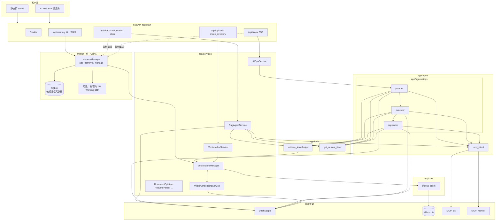
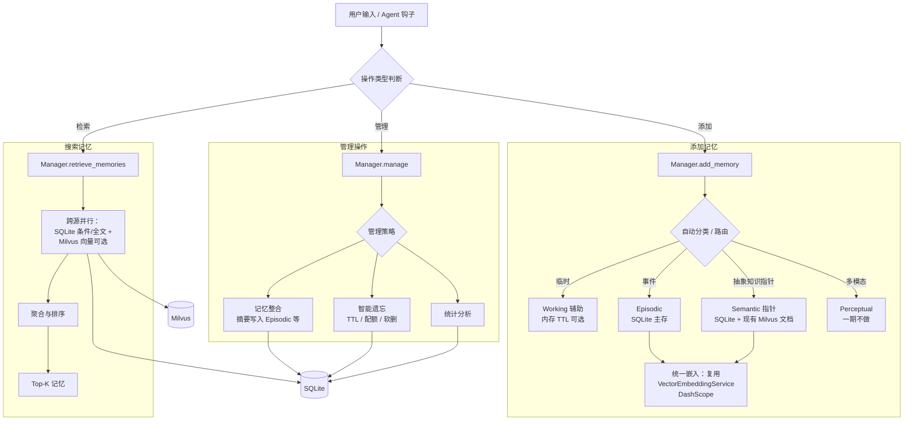

# 记忆系统后续实施计划（规划稿）

> **决策**：一期 **不引入 Neo4j**。语义检索继续 **Milvus**；结构化长期记忆 **SQLite**；Working 仍以 LangGraph 会话状态为主，可选进程内 TTL。  
> 本文含：**完整系统架构图**、**记忆子系统流程图**、**架构自查**、**SQLite 表设计讨论与推荐草案**。

---

## 0. 一期范围摘要

| 层级 | 一期做法 |
|------|----------|
| 语义 / 文档 RAG | 不变：`biz`、上传索引、`retrieve_knowledge` |
| 长期 / 事件记忆 | 新增：**SQLite** 存条目与元数据；检索由 **MemoryManager** 聚合 |
| 记忆向量（可选） | 若 episodic 需向量召回：Milvus **同库扩展 metadata** 或 **独立 collection**（实施前再定） |
| 图数据库 | **不采用 Neo4j**；复杂关联优先 **SQLite 表 + 索引**，必要时递归 CTE |
| 租户 / 用户 | **不做区分**（个人使用）；不按用户隔离，仅用 `session_id` 等区分会话 |

---

## 1. 完整系统架构图（原系统 + 一期记忆）

下图在先前「FastAPI / 双 Agent / Milvus / MCP / DashScope」整体结构上，叠加 **MemoryManager** 与 **SQLite**，**不含 Neo4j**。

**读图说明**

- **实线**：现有主数据流。  
- **虚线**：规划期与 Agent 的挂钩方式（对话 / AIOps 在需要「写入或检索记忆」时调 `MemoryManager`；具体调用点实施阶段再定）。  
- **MemoryManager → VSM**：仅在「某类记忆需要向量化」或「retrieve 要与 Milvus 联合 Top-K」时发生；纯结构化记忆可只读写 SQLite。

---

## 2. 记忆子系统内部流程（对齐参考图，一期落地）

**与参考图的差异（刻意简化）**

- 无 **Neo4j**；「语义」仍以 **Milvus 文档块** 为准，SQLite 存引用与业务标签。  
- **Episodic** 一期以 SQLite 行为主；是否每条都打向量见下文表设计讨论。

---

## 3. 整体架构自查（是否有问题）

| 关注点 | 说明 | 建议 |
|--------|------|------|
| 双写一致性 | 同一条「记忆」若同时落 SQLite 与 Milvus，需约定 **主键来源**（如 `memory_id` + `milvus_point_id`）与失败回滚策略 | 先 **SQLite 提交成功** 再异步/同步写 Milvus，或仅对「需向量检索」子集写 Milvus |
| 检索语义重叠 | `retrieve_knowledge` 与 `MemoryManager.retrieve` 可能返回相似片段 | Manager 层做 **去重、时间/来源加权**；对外可暴露统一 `context_pack` |
| 多进程 / 多副本 | `MemorySaver` 与进程内 TTL **不跨 worker** | 一期单实例可接受；上多 worker 时 TTL 迁 **Redis** 或只用 SQLite 时间字段驱动过期任务 |
| API 面 | 记忆若仅内嵌 Agent，调试困难 | 规划 **MEM_API** 或管理端最小 CRUD，便于排查与合规删除 |
| 安全与合规 | 记忆可能含 PII | 表级字段 **脱敏级别**、**按用户/租户隔离**、导出与硬删流程写进 P3 |

当前结论：**架构闭环成立**；主要风险在 **一致性、检索聚合、多实例**，可通过一期约束（单实例 + 明确主从存储）控制范围。

---

## 4. SQLite 库表设计：讨论与推荐草案

### 4.1 设计原则（建议先对齐）

1. **一条业务记忆 = 一行主表**（`memories`），扩展字段用 JSON 要克制，避免全表不可查。  
2. **类型用枚举**：`kind` = `episodic` | `semantic_ref` | `meta`（或再拆 `preference`），与规划中的「自动分类」一致；**不必**把 working 长期落库，若落库则 `kind=scratch` + 短 `expires_at`。  
3. **软删优先**：`deleted_at`，便于「遗忘」与审计。  
4. **与 Milvus 弱耦合**：单独关联表，避免在 `memories` 上堆多个可空列。  
5. **全文**：若需关键词检索，再上 **FTS5 虚拟表** 或依赖应用层；一期可仅用 `LIKE` + 索引，数据量上来再加 FTS。

### 4.2 可选路线对比

| 路线 | 做法 | 优点 | 缺点 |
|------|------|------|------|
| A. 宽表 + JSON | `memories` 含 `payload_json` | 迭代快 | 查询、索引难；易变「垃圾抽屉」 |
| B. 主表 + 关联表 | 核心列固定，扩展放 `memory_attributes(key,value)` | 灵活又可查部分维度 | 多表 join |
| C. 图式边表 | `entities` + `relations` + `memory_entity` | 不引入 Neo4j 也能表达关系 | 一期建模与 UI 成本高 |

**推荐一期**：**主表 `memories` + 关联表 `memory_milvus_refs` + 可选 `memory_tags`**；若 AIOps 强依赖「服务—告警」边，再在 **P2** 加极简 `relations`（两端 entity 用字符串 id 即可），仍不引入 Neo4j。

### 4.3 推荐表结构（草案，供评审）

**（1）`memories` — 主表**

| 列名 | 类型 | 说明 |
|------|------|------|
| `id` | TEXT UUID PK | 全局主键 |
| `session_id` | TEXT NULL | 对话 / 诊断线程（个人项目用会话区分即可，不做用户/租户字段） |
| `kind` | TEXT NOT NULL | `episodic` / `semantic_ref` / `scratch` / … |
| `source` | TEXT NOT NULL | `user` / `agent` / `system` |
| `title` | TEXT NULL | 短标题，便于列表展示 |
| `summary` | TEXT NULL | 检索与展示的摘要（建议控制长度） |
| `body` | TEXT NULL | 可选正文 |
| `payload_json` | TEXT NULL | 结构化扩展（JSON），宜有 schema 约定 |
| `importance` | REAL NULL | 0–1，供排序 |
| `created_at` | TEXT ISO8601 | 创建时间 |
| `updated_at` | TEXT ISO8601 | 更新时间 |
| `expires_at` | TEXT NULL | 过期时间；`scratch` / TTL 策略用 |
| `deleted_at` | TEXT NULL | 软删 |

**索引建议**：`(session_id, created_at DESC)`、`(kind, deleted_at)`。  
（已拍板：**不做** `tenant_id` / 用户区分；若日后改为多人共用，再迁移增加 `user_id` 或 `tenant_id` 及对应索引。）

**（2）`memory_milvus_refs` — 与向量库关联（可选行）**

| 列名 | 类型 | 说明 |
|------|------|------|
| `memory_id` | TEXT FK | 关联 `memories.id` |
| `collection_name` | TEXT | 如 `biz` 或未来 `memory_episodic` |
| `milvus_id` | TEXT | 与 LangChain Milvus 写入的 id 对齐 |
| `created_at` | TEXT | 写入时间 |

**约束**：同一 `memory_id` 可多条（一条记忆对应多个 chunk），聚合时在应用层合并。

**（3）`memory_tags` — 标签（可选）**

| 列名 | 类型 | 说明 |
|------|------|------|
| `memory_id` | TEXT FK | |
| `tag` | TEXT | 小写归一化 |
| PK | `(memory_id, tag)` | |

**（4）远期可选：`entities` / `relations`**

仅当产品确认要在 SQLite 内做「轻图」时再开表；一期 **可不建**，避免过度设计。

### 4.4 待讨论问题（需要你拍板）

1. **租户 / 用户区分**（已拍板）：**不做**。本项目按 **个人使用** 设计，不引入 `tenant_id`、不按登录用户隔离数据；仅用 **`session_id`** 等区分不同对话/诊断线程即可。若以后部署为多人服务，再在 schema 迁移中增加隔离字段。  
2. **Episodic 是否向量化**：每条 episodic 都打 Milvus，还是仅「用户点收藏 / 标重要」才打？（影响成本与 `memory_milvus_refs` 填充率）  
3. **`semantic_ref` 与上传文档**：是否允许 `memories` 只存 `source_file` + 段落锚点，而不重复存 `body`？（减少与 Milvus 内容重复）  
4. **FTS5**：是否坚持一期就上，还是 **P2** 再加？

---

## 5. 目标与路线图（节选，与初稿一致）

| 操作类型 | 能力概要 |
|----------|----------|
| 添加记忆 | 路由后写 SQLite；需向量则写 Milvus 并写 `memory_milvus_refs` |
| 搜索记忆 | SQLite + 可选 Milvus 并行，聚合 Top-K |
| 管理操作 | 整合、遗忘、统计；不替代现有 Milvus 集合运维 |

| 阶段 | 内容 |
|------|------|
| P0 | 定稿表结构 + migration 约定 |
| P1 | MemoryManager 最小实现 + 测试 |
| P2 | 与 `retrieve_knowledge` 聚合策略 |
| P3 | 过期、清理、简单 consolidate |
| P4 | 若 SQLite 关系不足再评估专用图库（非一期范围） |

---

## 6. 风险与约束（保留）

- 双源检索一致性、PII、多 worker 与 TTL，见第 3 节。

---

## 7. 待确认事项（更新）

1. **租户 / 用户**：**已定** — 个人项目，不做用户或租户区分（无 `tenant_id`）。  
2. **写入策略**：仅用户显式「记住」 / 允许 Agent 自动摘要（及配额）。  
3. **Episodic 向量**：独立 collection / `biz` + metadata 区分 / 一期不向量化。

---

*文档版本：含完整架构图与 SQLite 讨论稿。定稿后可拆实施任务清单。*
